<!-- README.md is generated from README.Rmd. Please edit that file -->

# ggNetView 

<!-- badges: start -->

<!-- badges: end -->

ggNetView: An R Package for Reproducible Biological Network Analysis and
Visualization. It provides flexible and publication-ready tools for
exploring complex biological and ecological networks.

[GitHub Repository](https://github.com/Jiawang1209/ggNetView)

[User Manual](https://jiawang1209.github.io/ggNetView-manual/)

[Zenodo DOI](https://doi.org/10.5281/zenodo.20175076)

## Installation

`ggNetView` depends on a number of CRAN packages. We recommend
installing the required dependencies first, and then installing
`ggNetView` from GitHub.

Current development release: v0.1.0

### Step1: install CRAN dependencies

    cran_pkgs <- c(
      "boot", "dplyr", "FNN", "future", "future.apply",
      "ggforce", "ggnewscale", "ggplot2", "ggraph", "ggrepel",
      "Hmisc", "huge", "igraph", "magrittr", "MASS",
      "Matrix", "patchwork", "progressr", "psych", "purrr",
      "qgraph", "Rcpp", "RcppArmadillo", "readr", "rlang",
      "scales", "scatterpie", "stringr", "tibble", "tidygraph",
      "tidyr", "vegan", "VGAM", "WGCNA"
    )

    new_pkgs <- cran_pkgs[!cran_pkgs %in% installed.packages()[, "Package"]]
    if (length(new_pkgs)) install.packages(new_pkgs)

### Step2: (optional) install suggested packages

These packages are not required for the core functionality, but enable
additional features (e.g. dynamic tree cut, node influence, vignettes,
tests):

    install.packages(c("dynamicTreeCut", "influential",
                       "knitr", "rmarkdown",
                       "RobustRankAggreg", "testthat"))

### Step3: install ggNetView from GitHub

    # install.packages("devtools")
    devtools::install_github("Jiawang1209/ggNetView")

## Example1: Co-expression Network

### Step1: load ggNetView

``` r
library(ggplot2)
#> Warning: package 'ggplot2' was built under R version 4.5.2
library(ggnewscale)
library(ggNetView)
#> 
#>                                                ░██               ░██
#>                                                ░██
#>  ░████████  ░████████ ░████████   ░███████  ░████████ ░██    ░██ ░██ ░███████  ░██    ░██    ░██
#> ░██    ░██ ░██    ░██ ░██    ░██ ░██    ░██    ░██    ░██    ░██ ░██░██    ░██ ░██    ░██    ░██
#> ░██    ░██ ░██    ░██ ░██    ░██ ░█████████    ░██     ░██  ░██  ░██░█████████  ░██  ░████  ░██
#> ░██   ░███ ░██   ░███ ░██    ░██ ░██           ░██      ░██░██   ░██░██          ░██░██ ░██░██
#>  ░█████░██  ░█████░██ ░██    ░██  ░███████      ░████    ░███    ░██ ░███████     ░███   ░███
#>        ░██        ░██
#>  ░███████   ░███████
#> 
#> 
#> ggNetView: Reproducible and Deterministic Network Analysis and Visualization
#> Version: 0.1.0
#> 
#>   Authors:     Yue Liu, Chao Wang
#>   Maintainer:  Yue Liu <yueliu@iae.ac.cn>
#> 
#>   Manual:      https://jiawang1209.github.io/ggNetView-manual/
#>   GitHub:      https://github.com/Jiawang1209/ggNetView
#>   Bug Reports: https://github.com/Jiawang1209/ggNetView/issues
#> 
#>   Type citation('ggNetView') for how to cite this package.
```

### Step2: load Data

> You can load raw matrix

``` r
data("otu_tab")          # raw OTU/feature count matrix (features x samples)
otu_tab[1:5, 1:5]        # peek at the first 5 rows/cols
#>        KO1  KO2  KO3  KO4  KO5
#> ASV_1 1113 1968  816 1372 1062
#> ASV_2 1922 1227 2355 2218 2885
#> ASV_3  568  460  899  902 1226
#> ASV_4 1433  400  535  759 1287
#> ASV_6  882  673  819  888 1475
```

> You can load rarely matrix. Note : the rownames of `otu_rare` is the
> features.

``` r
data("otu_rare")         # rarefied count matrix; rownames = features
otu_tab[1:5, 1:5]        # peek at the first 5 rows/cols
#>        KO1  KO2  KO3  KO4  KO5
#> ASV_1 1113 1968  816 1372 1062
#> ASV_2 1922 1227 2355 2218 2885
#> ASV_3  568  460  899  902 1226
#> ASV_4 1433  400  535  759 1287
#> ASV_6  882  673  819  888 1475
```

> 

``` r
data("otu_rare_relative")        # rarefied + relative-abundance matrix (features x samples)
otu_rare_relative[1:5, 1:5]      # peek at the first 5 rows/cols
#>              KO1        KO2        KO3        KO4        KO5
#> ASV_1 0.03306667 0.05453333 0.02013333 0.03613333 0.02686667
#> ASV_2 0.05750000 0.03393333 0.06046667 0.05810000 0.07320000
#> ASV_3 0.01733333 0.01296667 0.02290000 0.02336667 0.03106667
#> ASV_4 0.04266667 0.01093333 0.01416667 0.01933333 0.03346667
#> ASV_6 0.02646667 0.01856667 0.02110000 0.02353333 0.03806667
```

> You can load node annotation. Note : the rownames of `tax_tab` is
> NULL.

``` r
data("tax_tab")          # node (taxonomy) annotation table; rownames = NULL
tax_tab[1:5, 1:5]        # peek at the first 5 rows/cols
#> # A tibble: 5 × 5
#>   OTUID  Kingdom  Phylum          Class          Order            
#>   <chr>  <chr>    <chr>           <chr>          <chr>            
#> 1 ASV_2  Archaea  Thaumarchaeota  Unassigned     Nitrososphaerales
#> 2 ASV_3  Bacteria Verrucomicrobia Spartobacteria Unassigned       
#> 3 ASV_31 Bacteria Actinobacteria  Actinobacteria Actinomycetales  
#> 4 ASV_27 Archaea  Thaumarchaeota  Unassigned     Nitrososphaerales
#> 5 ASV_9  Bacteria Unassigned      Unassigned     Unassigned
```

### Step3: create graph object

``` r
obj <- build_graph_from_mat(
  mat = otu_rare_relative,    # variables x samples abundance matrix
  transfrom.method = "none",  # pre-correlation transform; "none" = keep as-is
  method = "WGCNA",           # correlation backend: WGCNA::corAndPvalue
  cor.method = "pearson",     # Pearson correlation
  proc = "BH",                # multiple-testing correction (Benjamini-Hochberg)
  r.threshold = 0.7,          # |r| cutoff for keeping an edge
  p.threshold = 0.05,         # adjusted p-value cutoff
  node_annotation = tax_tab   # taxonomy joined onto each node by name
)

obj                           # tbl_graph with Modularity / Degree / Strength + taxonomy
#> # A tbl_graph: 2049 nodes and 9602 edges
#> #
#> # An undirected simple graph with 100 components
#> #
#> # Node Data: 2,049 × 14 (active)
#>    name    modularity modularity2 modularity3 Modularity Degree Strength Kingdom
#>    <chr>   <fct>      <ord>       <chr>       <ord>       <dbl>    <dbl> <chr>  
#>  1 ASV_916 1          1           1           1              58     50.5 Bacter…
#>  2 ASV_777 1          1           1           1              58     48.7 Bacter…
#>  3 ASV_606 1          1           1           1              55     45.8 Bacter…
#>  4 ASV_740 1          1           1           1              54     47.2 Bacter…
#>  5 ASV_14… 1          1           1           1              54     44.5 Bacter…
#>  6 ASV_23… 1          1           1           1              54     47.4 Bacter…
#>  7 ASV_15… 1          1           1           1              52     45.3 Bacter…
#>  8 ASV_24… 1          1           1           1              52     43.0 Bacter…
#>  9 ASV_19… 1          1           1           1              52     43.0 Bacter…
#> 10 ASV_568 1          1           1           1              51     45.1 Bacter…
#> # ℹ 2,039 more rows
#> # ℹ 6 more variables: Phylum <chr>, Class <chr>, Order <chr>, Family <chr>,
#> #   Genus <chr>, Species <chr>
#> #
#> # Edge Data: 9,602 × 5
#>    from    to weight correlation corr_direction
#>   <int> <int>  <dbl>       <dbl> <chr>         
#> 1  1771  1825  0.793       0.793 Positive      
#> 2   594   597  0.895       0.895 Positive      
#> 3   588   597  0.864       0.864 Positive      
#> # ℹ 9,599 more rows
```

### Step4: ggNetView to plot

> Basic network plot

``` r
p1 <- ggNetView(
  graph_obj = obj,             # tbl_graph from build_graph_from_mat()
  layout = "gephi",            # node-positioning algorithm
  layout.module = "adjacent",  # place neighbouring modules close together
  group.by = "Modularity",     # node attribute used to define groups/modules
  fill.by = "Modularity",      # node attribute mapped to point fill
  pointsize = c(1, 5),         # min/max node size range
  center = F,                  # do NOT pull nodes toward each module centre
  jitter = F,                  # no positional jitter
  mapping_line = F,            # do not map edge aesthetics (uniform edges)
  shrink = 0.9,                # shrink layout inward (smaller = more compact)
  linealpha = 0.2,             # edge transparency
  linecolor = "#d9d9d9"        # edge colour
)

p1
```

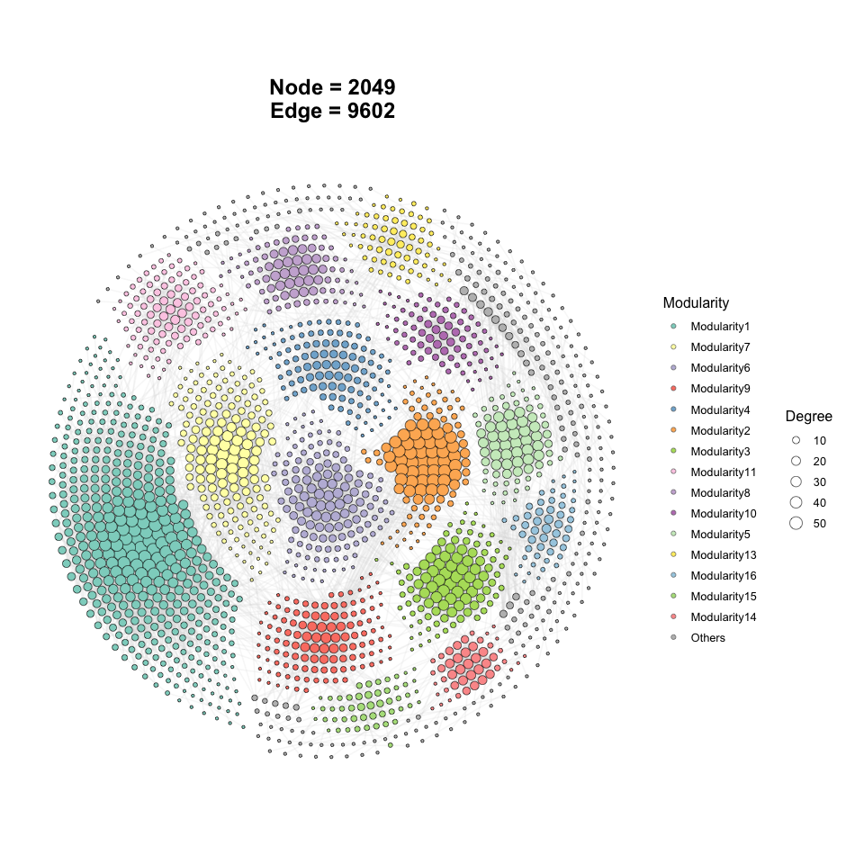

    ggsave(file = "Output/p1.pdf",
           plot = p1,
           height = 10,
           width = 10)

> Add outer line in netwotk plot

``` r
p2 <- ggNetView(
  graph_obj = obj,             # tbl_graph from build_graph_from_mat()
  layout = "gephi",            # node-positioning algorithm
  layout.module = "adjacent",  # place neighbouring modules close together
  group.by = "Modularity",     # node attribute used to define groups/modules
  fill.by = "Modularity",      # node attribute mapped to point fill
  pointsize = c(1, 5),         # min/max node size range
  center = F,                  # do NOT pull nodes toward each module centre
  jitter = TRUE,               # jitter node positions to reduce overlap
  jitter_sd = 0.15,            # SD of the jitter (bigger -> more spread)
  mapping_line = TRUE,         # map edge aesthetics
  shrink = 0.9,                # shrink layout inward (smaller = more compact)
  linealpha = 0.2,             # edge transparency
  linecolor = "#d9d9d9",       # edge colour
  add_outer = T,               # draw an outer hull/line around each module
  label = T                    # show node labels
)
#> Coordinate system already present.
#> ℹ Adding new coordinate system, which will replace the existing one.

p2
```

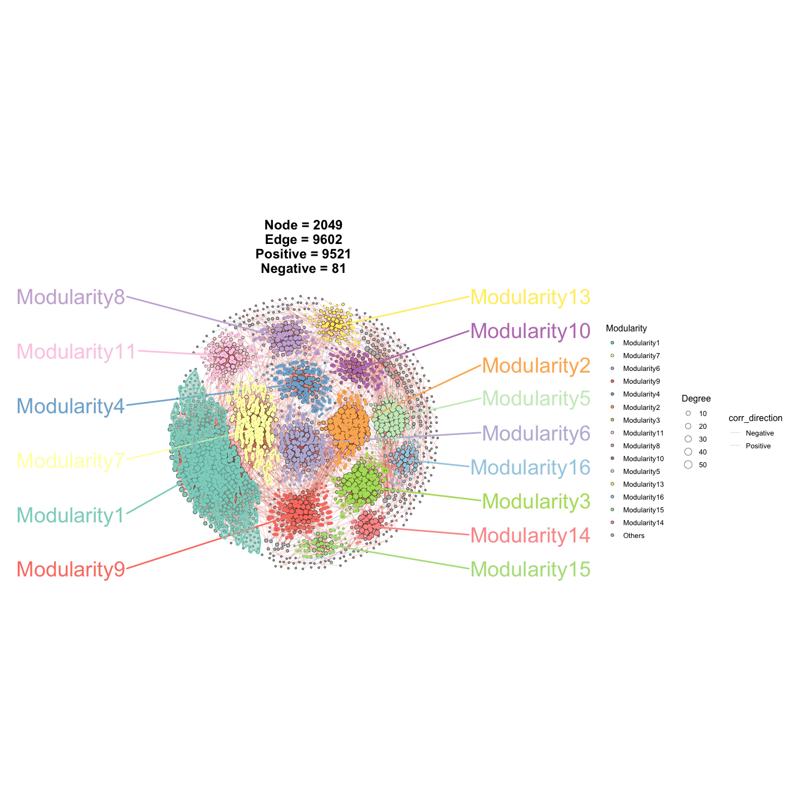

    ggsave(file = "Output/p2.pdf",
           plot = p2,
           height = 10,
           width = 10)

> Change the fill of node points.

``` r
p3 <- ggNetView(
  graph_obj = obj,             # tbl_graph from build_graph_from_mat()
  layout = "gephi",            # node-positioning algorithm
  layout.module = "adjacent",  # place neighbouring modules close together
  group.by = "Modularity",     # group nodes by module
  fill.by = "Phylum",          # map point fill to taxonomy (Phylum) instead of module
  pointsize = c(1, 5),         # min/max node size range
  center = F,                  # do NOT pull nodes toward each module centre
  jitter = TRUE,               # jitter node positions to reduce overlap
  jitter_sd = 0.15,            # SD of the jitter
  mapping_line = TRUE,         # map edge aesthetics
  shrink = 0.9,                # shrink layout inward
  linealpha = 0.2,             # edge transparency
  linecolor = "#d9d9d9",       # edge colour
  add_outer = T,               # draw an outer hull/line around each module
  label = T                    # show node labels
)
#> Coordinate system already present.
#> ℹ Adding new coordinate system, which will replace the existing one.

p3
```


    ggsave(file = "Output/p3.pdf",
           plot = p3,
           height = 10,
           width = 10)

> Change the color of node points.

``` r
p4 <- ggNetView(
  graph_obj = obj,             # tbl_graph from build_graph_from_mat()
  layout = "gephi",            # node-positioning algorithm
  layout.module = "adjacent",  # place neighbouring modules close together
  group.by = "Modularity",     # group nodes by module
  fill.by = "Phylum",          # map point fill to taxonomy (Phylum)
  color.by = "Phylum",         # map point border colour to taxonomy (Phylum)
  pointsize = c(1, 5),         # min/max node size range
  center = F,                  # do NOT pull nodes toward each module centre
  jitter = TRUE,               # jitter node positions to reduce overlap
  jitter_sd = 0.15,            # SD of the jitter
  mapping_line = TRUE,         # map edge aesthetics
  shrink = 0.9,                # shrink layout inward
  linealpha = 0.2,             # edge transparency
  linecolor = "#d9d9d9",       # edge colour
  add_outer = T,               # draw an outer hull/line around each module
  label = T                    # show node labels
)
#> Coordinate system already present.
#> ℹ Adding new coordinate system, which will replace the existing one.

p4
```

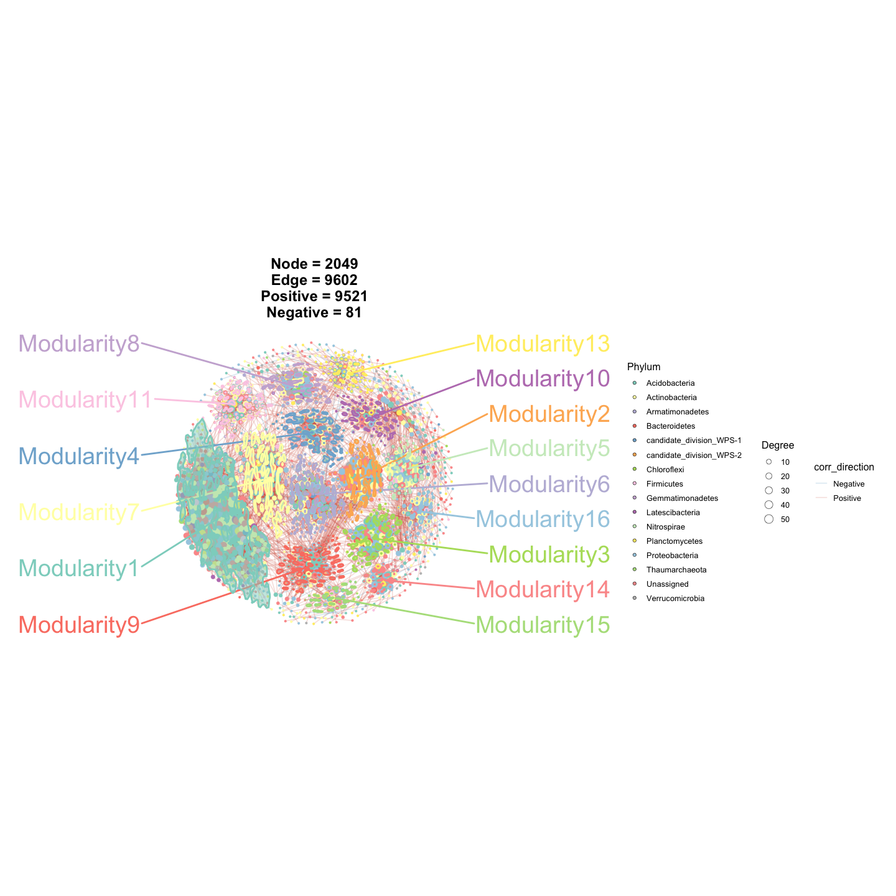

    ggsave(file = "Output/p4.pdf",
           plot = p4,
           height = 10,
           width = 10)

> Add node label

``` r
p5 <- ggNetView(
  graph_obj = obj,             # tbl_graph from build_graph_from_mat()
  layout = "gephi",            # node-positioning algorithm
  layout.module = "adjacent",  # place neighbouring modules close together
  group.by = "Modularity",     # group nodes by module
  fill.by = "Modularity",      # map point fill to module
  pointsize = c(1, 5),         # min/max node size range
  center = F,                  # do NOT pull nodes toward each module centre
  jitter = TRUE,               # jitter node positions to reduce overlap
  jitter_sd = 0.15,            # SD of the jitter
  mapping_line = TRUE,         # map edge aesthetics
  shrink = 0.9,                # shrink layout inward
  linealpha = 0.2,             # edge transparency
  linecolor = "#d9d9d9",       # edge colour
  add_outer = T,               # draw an outer hull/line around each module
  label = T,                   # show node labels
  pointlabel = "top1"          # label only the top-1 hub node per module
)
#> Coordinate system already present.
#> ℹ Adding new coordinate system, which will replace the existing one.

p5
```


    ggsave(file = "Output/p3.pdf", 
           plot = p5,
           height = 10,
           width = 10)

## Example2: Subgraph

> Get information of graph_object

``` r
Sub_module_1 <- get_subgraph(
  graph_obj = obj,        # full tbl_graph object
  select_module = "1"     # extract the subgraph for module "1"
)
#>    Module Number
#> 1       1    416
#> 2       7    161
#> 3       6    137
#> 4       9    121
#> 5       4    112
#> 6       2    105
#> 7       3    104
#> 8      11    101
#> 9       8     87
#> 10     10     80
#> 11      5     78
#> 12     13     70
#> 13     16     52
#> 14     15     51
#> 15     14     46
#> 16 Others    328

names(Sub_module_1)       # components returned for the selected module
#> [1] "sub_graph_all"    "stat_module"      "sub_graph_select"
```

## Example3: Mantel-test with environment

``` r
# load test data in ggNetView
data("Envdf_4st")   # environmental factor table (samples x env variables)
data("Spedf")       # species/community table (samples x taxa)
```

``` r
out1 <- gglink_heatmaps(
  env = Envdf_4st,                  # environmental data frame
  spec = Spedf,                     # species/community data frame
  env_select = list(Env01 = 1:14,   # group env columns into blocks:  Env01 = cols 1-14
                    Env02 = 15:28,  #                                 Env02 = cols 15-28
                    Env03 = 29:42,  #                                 Env03 = cols 29-42
                    Env04 = 43:56), #                                 Env04 = cols 43-56
  spec_select = list(Spec01 = 1:8), # species block: Spec01 = cols 1-8
  relation_method = "correlation",  # env-spec association via correlation (vs "mantel")
  spec_layout = "circle_outline",   # arrange species heatmap as a circular outline
  cor.method = "pearson",           # Pearson correlation
  cor.use = "pairwise",             # pairwise-complete handling of missing values
  r = 6,                            # radius of the circular layout
  distance = 1,                     # spacing between heatmap blocks
  orientation = c("top_right", "bottom_right", "top_left", "bottom_left")  # placement of each env block
)
#> The max module in network is 2 we use the 2  modules for next analysis

out1[[1]]                           # first plot in the returned list
```

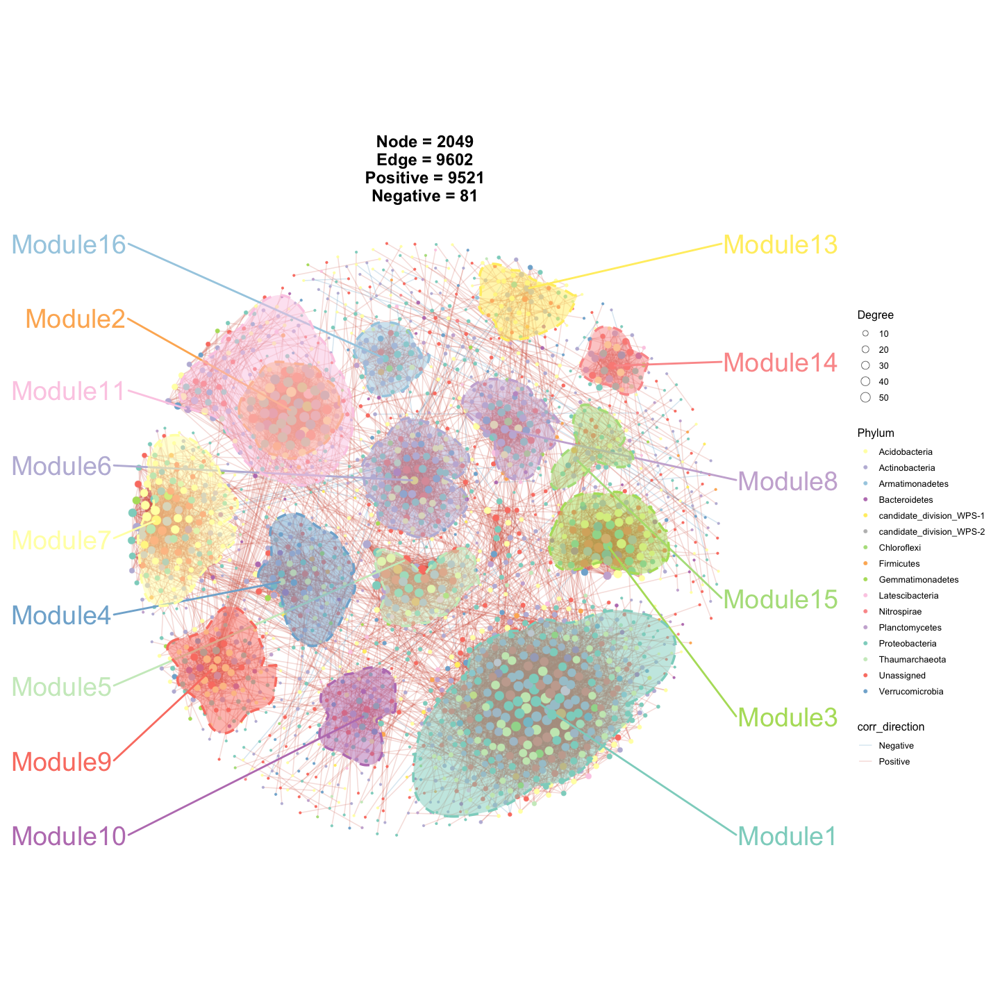

## Example4: Mantel-test with environment

> Leave lines with a significance level less than 0.05, and change the
> color of heatmap.

``` r
out2 <- gglink_heatmaps(
  env = Envdf_4st,                  # environmental data frame
  spec = Spedf,                     # species/community data frame
  env_select = list(Env01 = 1:14,   # env block Env01 = cols 1-14
                    Env03 = 29:40,  #           Env03 = cols 29-40
                    Env04 = 43:50), #           Env04 = cols 43-50
  spec_select = list(Spec01 = 1:8), # species block: Spec01 = cols 1-8
  relation_method = "correlation",  # association via correlation
  spec_layout = "circle_outline",   # circular outline layout for species heatmap
  cor.method = "pearson",           # Pearson correlation
  cor.use = "pairwise",             # pairwise-complete handling of missing values
  drop_nonsig = TRUE,               # keep only links with p < 0.05 (drop non-significant)
  HeatmapColorBar = list(c("#2166ac", "#b2182b"),   # custom low->high colour ramp per env block
                         c("#1b7837", "#762a83"),
                         c("#4393c3", "#d6604d")),
  HeatmapPointFill = "#8c6bb1",     # fill colour of heatmap anchor points
  CorePointFill = "#225ea8",        # fill colour of the central/core point
  HeatmapLabelOrient = 45,          # rotate heatmap labels by 45 degrees
  r = 6,                            # radius of the circular layout
  distance = 1,                     # spacing between heatmap blocks
  orientation = c("top_right", "top_left", "bottom_left")  # placement of each env block
)
#> The max module in network is 2 we use the 2  modules for next analysis

out2[[2]]                           # second plot in the returned list
```

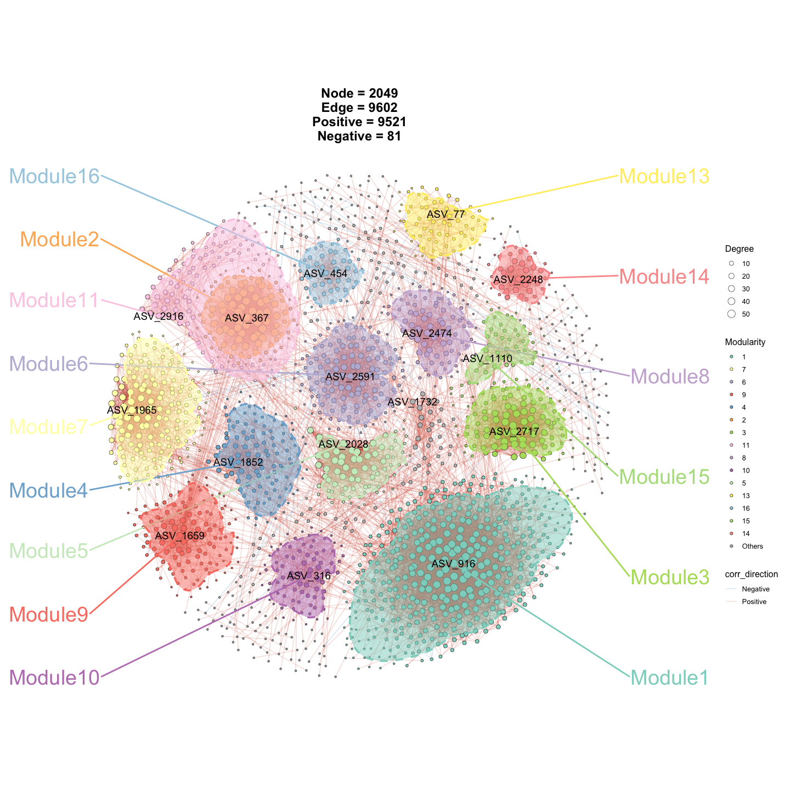

## Example5: Network-environment

``` r
####----load Data----####
data("otu_rare_relative")   # rarefied relative-abundance matrix (features x samples)
data("tax_tab")             # node (taxonomy) annotation table
data("Envdf_4st_2")         # environmental factor table for the network-env analysis


####----build graph object----####
graph_obj <- build_graph_from_mat(
  mat = otu_rare_relative,       # variables x samples abundance matrix
  transfrom.method = "none",     # pre-correlation transform; "none" = keep as-is
  node_annotation = tax_tab,     # taxonomy joined onto each node by name
  p.threshold = 0.05,            # adjusted p-value cutoff
  r.threshold = 0.75,            # |r| cutoff for keeping an edge
  method = "WGCNA",              # correlation backend: WGCNA::corAndPvalue
  proc = "BH",                   # multiple-testing correction (Benjamini-Hochberg)
  module.method = "Fast_greedy", # community detection algorithm
  top_modules = 15,              # keep top-15 modules; rest -> "Others"
  seed = 1115                    # fix RNG for reproducibility
)

graph_obj                        # resulting tbl_graph
#> # A tbl_graph: 2049 nodes and 9602 edges
#> #
#> # An undirected simple graph with 100 components
#> #
#> # Node Data: 2,049 × 14 (active)
#>    name    modularity modularity2 modularity3 Modularity Degree Strength Kingdom
#>    <chr>   <fct>      <ord>       <chr>       <ord>       <dbl>    <dbl> <chr>  
#>  1 ASV_916 1          1           1           1              58     50.5 Bacter…
#>  2 ASV_777 1          1           1           1              58     48.7 Bacter…
#>  3 ASV_606 1          1           1           1              55     45.8 Bacter…
#>  4 ASV_740 1          1           1           1              54     47.2 Bacter…
#>  5 ASV_14… 1          1           1           1              54     44.5 Bacter…
#>  6 ASV_23… 1          1           1           1              54     47.4 Bacter…
#>  7 ASV_15… 1          1           1           1              52     45.3 Bacter…
#>  8 ASV_24… 1          1           1           1              52     43.0 Bacter…
#>  9 ASV_19… 1          1           1           1              52     43.0 Bacter…
#> 10 ASV_568 1          1           1           1              51     45.1 Bacter…
#> # ℹ 2,039 more rows
#> # ℹ 6 more variables: Phylum <chr>, Class <chr>, Order <chr>, Family <chr>,
#> #   Genus <chr>, Species <chr>
#> #
#> # Edge Data: 9,602 × 5
#>    from    to weight correlation corr_direction
#>   <int> <int>  <dbl>       <dbl> <chr>         
#> 1  1771  1825  0.793       0.793 Positive      
#> 2   594   597  0.895       0.895 Positive      
#> 3   588   597  0.864       0.864 Positive      
#> # ℹ 9,599 more rows


p_sub <- ggNetView(
  graph_obj = graph_obj,       # tbl_graph object
  layout = "gephi",            # node-positioning algorithm
  center = T,                  # pull nodes toward each module centre
  layout.module = "adjacent",  # place neighbouring modules close together
  group.by = "Modularity",     # group nodes by module
  fill.by = "Modularity"       # map point fill to module
)

p_sub
```

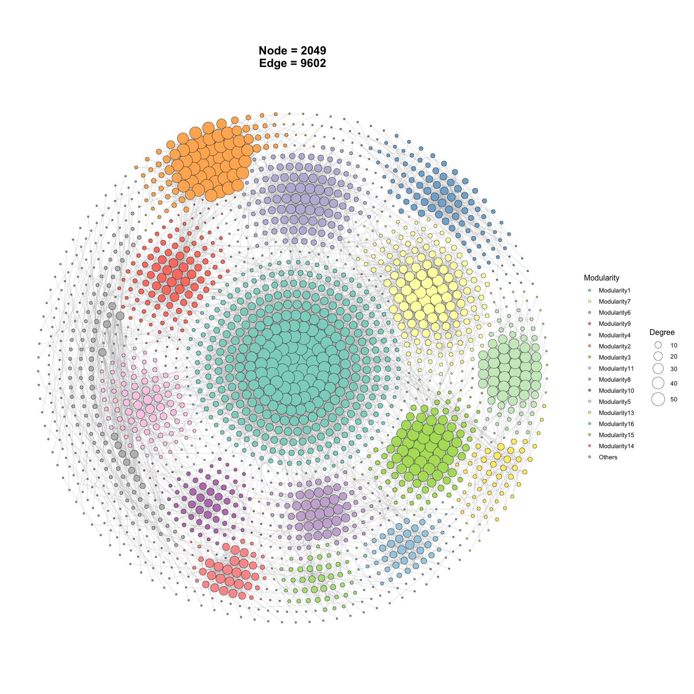

``` r


p_sub2 <- ggNetView(
  graph_obj = graph_obj,       # tbl_graph object
  layout = "gephi",            # node-positioning algorithm
  center = F,                  # do NOT pull nodes toward each module centre (compare with p_sub)
  layout.module = "adjacent",  # place neighbouring modules close together
  group.by = "Modularity",     # group nodes by module
  fill.by = "Modularity"       # map point fill to module
)

p_sub2
```

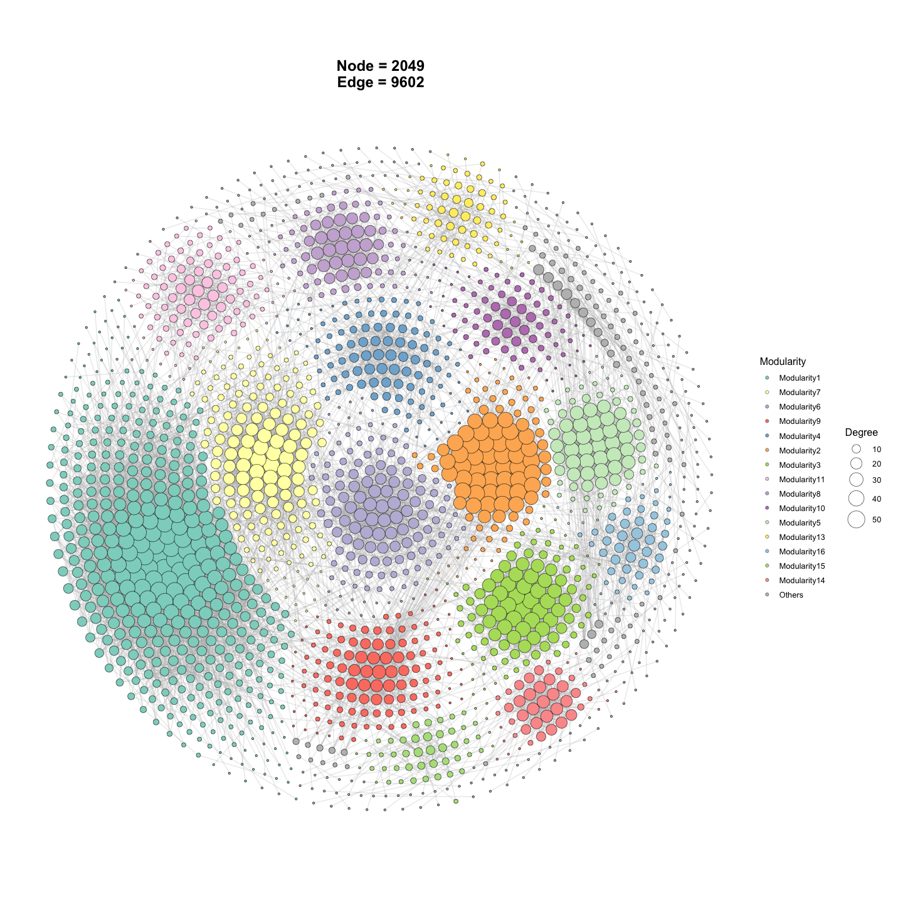

``` r

####----Network Environment PC1----####
res <- ggnetview_modularity_heatmaps(
  graph_obj,                        # network tbl_graph object
  Envdf_4st_2,                      # environmental factor table
  otu_rare_relative,                # abundance matrix (used to derive per-module index)
  env_select = list(Env01 = 1:14,   # env block Env01 = cols 1-14
                    Env02 = 15:28,   #           Env02 = cols 15-28
                    Env03 = 29:42,   #           Env03 = cols 29-42
                    Env04 = 43:56),  #           Env04 = cols 43-56
  drop_nonsig = T,                  # keep only significant module-env links
  r = 35,                           # radius of the circular heatmap layout
  distance = 5,                     # spacing between heatmap blocks
  HeatmapLabelOrient = 45,          # rotate heatmap labels by 45 degrees
  shrink = 0.65,                    # shrink the network layout inward
  module_index = "eigengene",  # 或 "abundance"   # per-module summary: eigengene (PC1)
  relation_method = "correlation",  # 或 "mantel",  # module-env association method
  HeatmapColorBar = list(           # custom low->high colour ramp per env block
    c("#2166ac", "#b2182b"),
    c("#1b7837", "#762a83"),
    c("#4393c3", "#d6604d"),
    c("#92c5de", "#f4a582")
  ),
  layout = "gephi",                 # node-positioning algorithm
  layout.module = "adjacent",       # place neighbouring modules close together
  jitter = T,                       # jitter node positions to reduce overlap
  add_outer = T,                    # draw an outer hull/line around each module
  HeatmapScale = 1.5,               # scale factor for heatmap point/tile size
  add_group_outer = T,              # draw an outer boundary around node groups
  label = F,                        # do not show node labels
  # labelsize = 5
)
#> Coordinate system already present.
#> ℹ Adding new coordinate system, which will replace the existing one.

res[[1]]
```

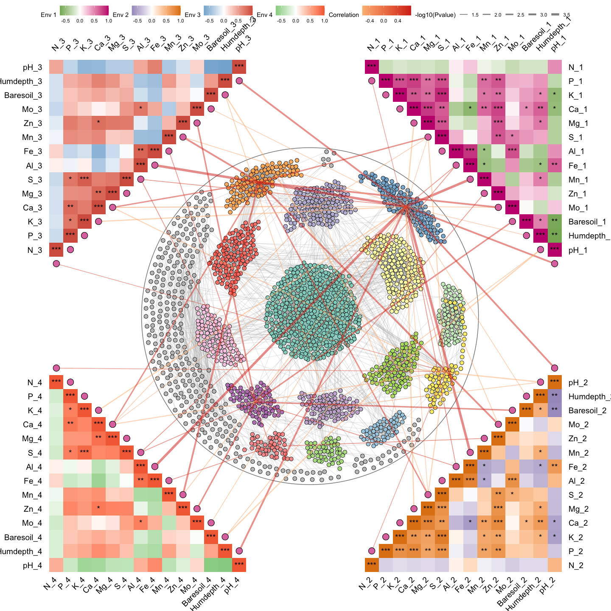

``` r

####----Network Environment abudance----####
res2 <- ggnetview_modularity_heatmaps(
  graph_obj,                        # network tbl_graph object
  Envdf_4st_2,                      # environmental factor table
  otu_rare_relative,                # abundance matrix (used to derive per-module index)
  env_select = list(Env01 = 1:14,   # env block Env01 = cols 1-14
                    Env02 = 15:28,   #           Env02 = cols 15-28
                    Env03 = 29:42,   #           Env03 = cols 29-42
                    Env04 = 43:56),  #           Env04 = cols 43-56
  drop_nonsig = T,                  # keep only significant module-env links
  r = 35,                           # radius of the circular heatmap layout
  distance = 5,                     # spacing between heatmap blocks
  HeatmapLabelOrient = 45,          # rotate heatmap labels by 45 degrees
  shrink = 0.65,                    # shrink the network layout inward
  module_index = "abundance",  # 或 "abundance"   # per-module summary: aggregated abundance
  relation_method = "mantel",  # 或 "mantel",      # module-env association via Mantel test
  HeatmapColorBar = list(           # custom low->high colour ramp per env block
    c("#2166ac", "#b2182b"),
    c("#1b7837", "#762a83"),
    c("#4393c3", "#d6604d"),
    c("#92c5de", "#f4a582")
  ),
  layout = "gephi",                 # node-positioning algorithm
  layout.module = "adjacent",       # place neighbouring modules close together
  jitter = T,                       # jitter node positions to reduce overlap
  add_outer = T,                    # draw an outer hull/line around each module
  HeatmapScale = 1.5,               # scale factor for heatmap point/tile size
  add_group_outer = T,              # draw an outer boundary around node groups
  label = F,                        # do not show node labels
  # labelsize = 5
)
#> Using `mantel_kind = "block_vs_col"`. Note: prior versions ran the equivalent of `"col_vs_col"` when `relation_method = "mantel"`. The new default is the ecologically standard `"block_vs_col"` (community matrix vs each env column). Pass `mantel_kind = "col_vs_col"` to reproduce old results.
#> Coordinate system already present.
#> ℹ Adding new coordinate system, which will replace the existing one.

res2[[1]]
```


``` r
res2[[2]]
```

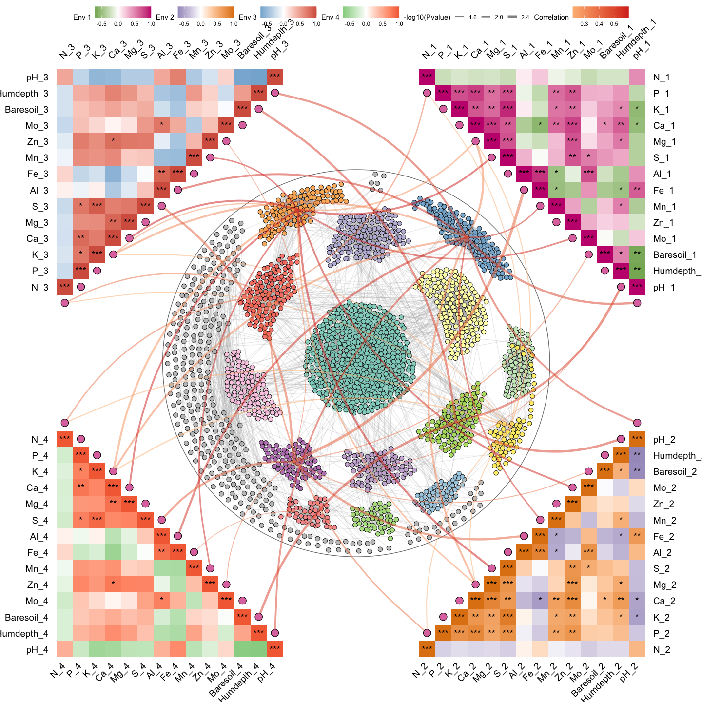

## Example6: Network-compare

``` r
# ---- Multi-network "linked" view (no per-group scale normalisation) ----
# `ggNetView_multi_link()` builds ONE network per group (defined by `group_info`),
# lays each one out independently, and places all sub-networks on a circular
# anchor frame so that cross-group edges/relationships can be visually compared.
out1 <- ggNetView_multi_link(
  mat              = otu_rare_relative, # variables x samples abundance matrix
  group_info       = otu_sample,        # sample metadata; defines how samples are split into groups
  transfrom.method = "none",            # pre-correlation transform on `mat`; "none" = keep as-is
  r.threshold      = 0.7,               # |r| cutoff for keeping an edge
  p.threshold      = 0.05,              # adjusted p-value cutoff
  method           = "WGCNA",           # correlation backend: WGCNA::corAndPvalue
  cor.method       = "pearson",         # Pearson correlation
  proc             = "BH",              # multiple-testing correction (Benjamini-Hochberg)
  module.method    = "Fast_greedy",     # community detection per sub-network
  layout.module    = "adjacent",        # neighbouring modules placed close together
  center           = T,                 # pull a node toward the centre of each sub-layout
  top_modules      = 15,                # keep top-15 modules per sub-network; rest -> "Others"
  layout           = "gephi",           # global node-positioning algorithm per sub-network
  shrink           = 0.5,               # shrink each sub-network inward (smaller = more compact)
  scale            = F,                 # do NOT normalise each group to a common scale -> sub-networks keep their native size differences
  jitter           = T,                 # jitter node positions slightly to reduce overlap
  jitter_sd        = 0.3,               # SD of the jitter (bigger -> more spread)
  anchor_dist      = 30,                 # distance between groups on the outer anchor circle
  seed             = 1115,              # fix RNG for reproducibility
  orientation      = "up",              # frame orientation; one of "up"/"down"/"left"/"right"
  angle            = 0                  # additional rotation angle (degrees)
)
#> Scale for size is already present.
#> Adding another scale for size, which will replace the existing scale.
#> Scale for size is already present.
#> Adding another scale for size, which will replace the existing scale.

p1 <- out1[["p"]]   # the assembled ggplot object
p1
```

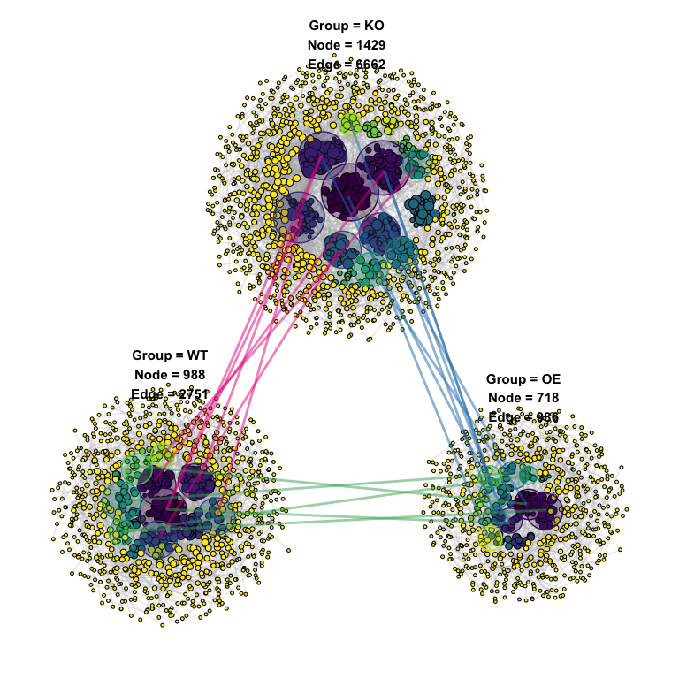

``` r

out1$info           # auxiliary table: per-group node/edge counts, module info, etc.
#> # A tibble: 22 × 11
#>    modA   modB   overlap sizeA sizeB overlap_coef  pvalue   FDR Group    GroupA
#>    <chr>  <chr>    <int> <int> <int>        <dbl>   <dbl> <dbl> <chr>    <chr> 
#>  1 15     1            2     6    14        0.333 0.0140  0.776 KO_to_OE KO    
#>  2 16     3            2    19     8        0.25  0.0450  1     KO_to_OE KO    
#>  3 52     6            1     4     3        0.333 0.0280  0.895 KO_to_OE KO    
#>  4 4      8            2    16     6        0.333 0.0182  0.776 KO_to_OE KO    
#>  5 3      9            2    22     3        0.667 0.00741 0.633 KO_to_OE KO    
#>  6 7      9            1     4     3        0.333 0.0280  0.895 KO_to_OE KO    
#>  7 3      12           2    22     3        0.667 0.00741 0.633 KO_to_OE KO    
#>  8 1      15           2    32     3        0.667 0.0157  0.776 KO_to_OE KO    
#>  9 Others Others     224   263   342        0.852 0.00109 0.279 KO_to_OE KO    
#> 10 16     1            4    29    28        0.143 0.0415  1     KO_to_WT KO    
#> # ℹ 12 more rows
#> # ℹ 1 more variable: GroupB <chr>
```

``` r
####----Plot2----####
# ---- Same setup but with `scale = TRUE` -> each group normalised to a common size ----
# Useful when groups have very different network sizes and you want them
# visually comparable side-by-side. With `scale = TRUE` the native size
# differences are removed, so jitter_sd is also reduced (0.01) accordingly.
out2 <- ggNetView_multi_link(
  mat              = otu_rare_relative,
  group_info       = otu_sample,
  transfrom.method = "none",
  r.threshold      = 0.7,
  p.threshold      = 0.05,
  method           = "WGCNA",
  cor.method       = "pearson",
  proc             = "BH",
  module.method    = "Fast_greedy",
  layout.module    = "adjacent",
  center           = T,
  top_modules      = 15,
  layout           = "gephi",
  shrink           = 0.5,
  scale            = T,                 # normalise each group to a comparable coordinate scale
  jitter           = T,
  jitter_sd        = 0.01,              # smaller jitter — sub-networks are already on a unified scale
  anchor_dist      = 1,
  seed             = 1115,
  orientation      = "up",
  angle            = 0
)
#> Scale for size is already present.
#> Adding another scale for size, which will replace the existing scale.
#> Scale for size is already present.
#> Adding another scale for size, which will replace the existing scale.


p2 <- out2[["p"]]
p2
```

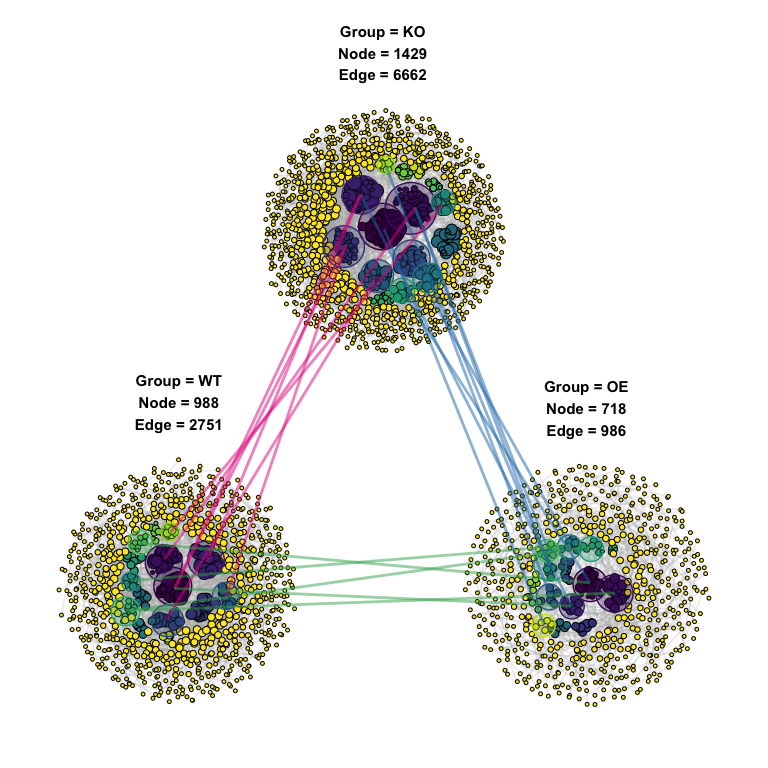

## Example7: Network-topology

``` r
# ---- Build a co-occurrence network from an abundance matrix ----
# Internal pipeline: transform -> correlation -> p-value adjustment ->
# edge filtering -> community detection -> attach taxonomy.
graph_obj <- build_graph_from_mat(
  mat              = otu_rare_relative,  # variables x samples numeric matrix
  transfrom.method = "none",             # input already relative abundance, no extra transform
  method           = "WGCNA",            # correlation backend: WGCNA::corAndPvalue
  proc             = "bonferroni",       # multiple-testing correction
  r.threshold      = 0.7,                # |r| cutoff for keeping an edge
  p.threshold      = 0.05,               # adjusted p-value cutoff
  node_annotation  = tax_tab,            # taxonomy joined onto each node by name
  top_modules      = 15,                 # keep top-15 modules; rest -> "Others"
  seed             = 1115                # fix RNG for reproducibility
)

graph_obj   # tbl_graph with Modularity / Degree / Strength + taxonomy columns
#> # A tbl_graph: 213 nodes and 844 edges
#> #
#> # An undirected simple graph with 29 components
#> #
#> # Node Data: 213 × 14 (active)
#>    name    modularity modularity2 modularity3 Modularity Degree Strength Kingdom
#>    <chr>   <fct>      <ord>       <chr>       <ord>       <dbl>    <dbl> <chr>  
#>  1 ASV_649 5          5           5           5              27     26.5 Bacter…
#>  2 ASV_705 5          5           5           5              27     26.5 Bacter…
#>  3 ASV_12… 5          5           5           5              27     26.5 Bacter…
#>  4 ASV_13… 5          5           5           5              27     26.5 Bacter…
#>  5 ASV_14… 5          5           5           5              27     26.5 Bacter…
#>  6 ASV_14… 5          5           5           5              27     26.5 Bacter…
#>  7 ASV_24… 5          5           5           5              27     26.5 Bacter…
#>  8 ASV_25… 5          5           5           5              27     26.4 Bacter…
#>  9 ASV_28… 5          5           5           5              27     26.5 Bacter…
#> 10 ASV_28… 5          5           5           5              27     26.5 Bacter…
#> # ℹ 203 more rows
#> # ℹ 6 more variables: Phylum <chr>, Class <chr>, Order <chr>, Family <chr>,
#> #   Genus <chr>, Species <chr>
#> #
#> # Edge Data: 844 × 5
#>    from    to weight correlation corr_direction
#>   <int> <int>  <dbl>       <dbl> <chr>         
#> 1   194   195  0.959       0.959 Positive      
#> 2   185   208  0.954       0.954 Positive      
#> 3   185   213  0.957       0.957 Positive      
#> # ℹ 841 more rows


# ---- Compute the FULL set of network topology + robustness metrics ----
# When `mat` is provided, the function recomputes the thresholded correlation
# matrix from `mat` (used as `network.raw`) and ALL topology fields are
# returned with real values - including the ones that are NA when mat = NULL:
#   Cohension_Positive / Cohension_Negative
#   Robustness_weight  / Robustness_unweight
#   Stability
#   out$Robustness     (the 5%-100% node-removal curve)
topology_with_mat <- get_network_topology(
  graph_obj        = graph_obj,         # input tbl_graph (required)
  mat              = otu_rare_relative, # raw abundance matrix used to derive sp.ra and rebuild network.raw
  transfrom.method = "none",            # pre-correlation transform on `mat`; "none" = keep as-is
  method           = "WGCNA",           # correlation backend: WGCNA::corAndPvalue
  proc             = "bonferroni",      # multiple-testing correction
  r.threshold      = 0.7,               # |r| cutoff for keeping an edge in network.raw
  p.threshold      = 0.05,              # adjusted p-value cutoff for keeping an edge
  bootstrap        = 100                # # of bootstrap iterations for robustness AND # of random ER networks for the Random_nerwork column
)


topology_with_mat
#> $topology
#> # A tibble: 24 × 3
#>    Topology            Target_network Random_nerwork
#>    <chr>                        <dbl>          <dbl>
#>  1 Node                      213            213     
#>  2 Edge                      844            844     
#>  3 Degree                      7.92           7.92  
#>  4 Distance                    1.45           2.81  
#>  5 Diameter                    3.83           5.04  
#>  6 Density                     0.0374         0.0374
#>  7 Transitivity_global         0.851          0.0371
#>  8 Transitivity_local          0.783          0.0372
#>  9 Betweenness                 3.47         191.    
#> 10 Betweenness_edge            2.58          75.0   
#> # ℹ 14 more rows
#> 
#> $Robustness
#>    Proportion.removed remain.mean   remain.sd    remain.se   weighted
#> 1                0.05  0.93765258 0.006506724 0.0006506724   weighted
#> 2                0.10  0.88042254 0.009907812 0.0009907812   weighted
#> 3                0.15  0.81859155 0.012057928 0.0012057928   weighted
#> 4                0.20  0.75816901 0.013453813 0.0013453813   weighted
#> 5                0.25  0.70455399 0.012630308 0.0012630308   weighted
#> 6                0.30  0.64333333 0.016021401 0.0016021401   weighted
#> 7                0.35  0.58652582 0.016937398 0.0016937398   weighted
#> 8                0.40  0.53028169 0.016859929 0.0016859929   weighted
#> 9                0.45  0.47309859 0.018089169 0.0018089169   weighted
#> 10               0.50  0.42140845 0.015919144 0.0015919144   weighted
#> 11               0.55  0.37046948 0.018756744 0.0018756744   weighted
#> 12               0.60  0.31450704 0.015513637 0.0015513637   weighted
#> 13               0.65  0.26737089 0.019720511 0.0019720511   weighted
#> 14               0.70  0.21652582 0.017859085 0.0017859085   weighted
#> 15               0.75  0.17023474 0.016271873 0.0016271873   weighted
#> 16               0.80  0.12455399 0.016887373 0.0016887373   weighted
#> 17               0.85  0.08291080 0.015878534 0.0015878534   weighted
#> 18               0.90  0.04262911 0.013423744 0.0013423744   weighted
#> 19               0.95  0.01413146 0.009998184 0.0009998184   weighted
#> 20               1.00  0.00000000 0.000000000 0.0000000000   weighted
#> 21               0.05  0.93666667 0.006347900 0.0006347900 unweighted
#> 22               0.10  0.88004695 0.009586197 0.0009586197 unweighted
#> 23               0.15  0.81882629 0.011087843 0.0011087843 unweighted
#> 24               0.20  0.75755869 0.014084823 0.0014084823 unweighted
#> 25               0.25  0.70258216 0.013923536 0.0013923536 unweighted
#> 26               0.30  0.64220657 0.014112853 0.0014112853 unweighted
#> 27               0.35  0.58239437 0.013335467 0.0013335467 unweighted
#> 28               0.40  0.53103286 0.016600696 0.0016600696 unweighted
#> 29               0.45  0.47755869 0.015290812 0.0015290812 unweighted
#> 30               0.50  0.42812207 0.015401290 0.0015401290 unweighted
#> 31               0.55  0.36694836 0.016218423 0.0016218423 unweighted
#> 32               0.60  0.31892019 0.018094092 0.0018094092 unweighted
#> 33               0.65  0.26699531 0.017332399 0.0017332399 unweighted
#> 34               0.70  0.21441315 0.017260315 0.0017260315 unweighted
#> 35               0.75  0.16938967 0.018751817 0.0018751817 unweighted
#> 36               0.80  0.12624413 0.017219505 0.0017219505 unweighted
#> 37               0.85  0.07910798 0.015222150 0.0015222150 unweighted
#> 38               0.90  0.04286385 0.012864348 0.0012864348 unweighted
#> 39               0.95  0.01413146 0.009519073 0.0009519073 unweighted
#> 40               1.00  0.00000000 0.000000000 0.0000000000 unweighted
```

## Example8: Zi-Pi

``` r
# Extract the two inputs Zi-Pi needs from graph object
nodes_bulk <- get_graph_nodes(obj)      # node table (module + degree cols)
adj_mat    <- get_graph_adjacency(obj)  # adjacency / correlation matrix


role_palette <- c(
  "Peripherals"  = "#377eb8",
  "Connectors"   = "#4daf4a",
  "Module hubs"  = "#e41a1c",
  "Network hubs" = "#ff7f00"
)

# Compute Zi-Pi and classify
zp <- ggnetview_zipi(
  nodes_bulk     = nodes_bulk,    # node table: IDs in rownames or a `name` col
  z_bulk_mat     = adj_mat,       # adjacency matrix; non-zero entries = edges
  modularity_col = "Modularity",  # column holding module labels (no NAs)
  degree_col     = "Degree",      # column holding node degree   (no NAs)
  zi_threshold   = 2.5,           # Zi cutoff for role classification
  pi_threshold   = 0.62,          # Pi cutoff for role classification
  na.rm          = FALSE,         # FALSE = keep unclassifiable nodes (type = NA)
  point_colors   = role_palette,  # point + legend colours, keyed by role
  bg_colors      = c(             # quadrant background fills, keyed by role
    "Peripherals"  = "#f0f0f0",
    "Connectors"   = "#d9f0d3",
    "Module hubs"  = "#fde0dd",
    "Network hubs" = "#fee8c8"
  ),
  label_colors   = role_palette,  # quadrant text-label colours (default: black)
  label_size     = 5,             # quadrant text-label size  (default 5.5)
  bg_alpha       = 0.35           # background opacity 0..1    (default 0.25)
)

class(zp)
#> [1] "list"

names(zp)
#> [1] "data" "plot"

zp$plot
#> Warning: Removed 1 row containing missing values or values outside the scale range
#> (`geom_text()`).
#> Removed 1 row containing missing values or values outside the scale range
#> (`geom_text()`).
```

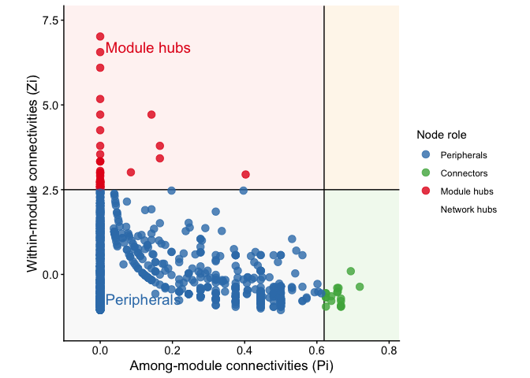

## Example9: RMT threshold

    # ---- RMT threshold scan #1: WGCNA correlation backend ----
    # `ggNetView_RMT()` scans a series of candidate |r| thresholds, builds the
    # thresholded correlation matrix at each, computes its eigenvalue spacing
    # distribution (NNSD), and picks the threshold at which the NNSD transitions
    # from Gaussian Orthogonal Ensemble (signal + noise) to Poisson (noise-free,
    # modular network) — this is the RMT-recommended cutoff.
    out <- ggNetView_RMT(
      mat              = otu_rare_relative, # input matrix (variables x samples)
      transfrom.method = "none",            # already relative-abundance, no extra transform
      method           = "WGCNA",           # use WGCNA::corAndPvalue for correlation
      cor.method       = "pearson",         # Pearson correlation
      unfold.method    = "gaussian",        # Gaussian KDE unfolding of eigenvalues
      bandwidth        = "nrd0",            # KDE bandwidth rule (stats::density default)
      nr.fit.points    = 20,                # support points (only used if unfold.method = "spline")
      discard.outliers = TRUE,              # IQR-trim extreme eigenvalues before unfolding
      discard.zeros    = TRUE,              # drop all-zero rows/cols after thresholding
      min.mat.dim      = 40,                # early-stop if effective dim drops below 40
      max.ev.spacing   = 3,                 # truncate NNSD tail at spacing = 3
      save_plots       = FALSE,             # don't write diagnostic PNGs to disk
      out_dir          = "RMT_plots",       # (only used when save_plots = TRUE)
      verbose          = TRUE,              # print scan progress to console
      seed             = 1115               # fix RNG for reproducibility
    )

    # The chosen threshold to feed downstream into build_graph_from_mat(r.threshold = ...)
    out$chosen_threshold

## sessionInfo

``` r
sessionInfo()
#> R version 4.5.1 (2025-06-13)
#> Platform: aarch64-apple-darwin20
#> Running under: macOS Tahoe 26.3.1
#> 
#> Matrix products: default
#> BLAS:   /Library/Frameworks/R.framework/Versions/4.5-arm64/Resources/lib/libRblas.0.dylib 
#> LAPACK: /Library/Frameworks/R.framework/Versions/4.5-arm64/Resources/lib/libRlapack.dylib;  LAPACK version 3.12.1
#> 
#> locale:
#> [1] en_US.UTF-8/en_US.UTF-8/en_US.UTF-8/C/en_US.UTF-8/en_US.UTF-8
#> 
#> time zone: Asia/Shanghai
#> tzcode source: internal
#> 
#> attached base packages:
#> [1] stats     graphics  grDevices utils     datasets  methods   base     
#> 
#> other attached packages:
#> [1] ggNetView_0.1.0  ggnewscale_0.5.2 ggplot2_4.0.3   
#> 
#> loaded via a namespace (and not attached):
#>  [1] tidyselect_1.2.1      psych_2.6.5           WGCNA_1.74           
#>  [4] viridisLite_0.4.3     dplyr_1.2.1           farver_2.1.2         
#>  [7] viridis_0.6.5         S7_0.2.2              ggraph_2.2.2         
#> [10] fastmap_1.2.0         tweenr_2.0.3          digest_0.6.39        
#> [13] rpart_4.1.24          lifecycle_1.0.5       cluster_2.1.8.1      
#> [16] survival_3.8-3        magrittr_2.0.5        compiler_4.5.1       
#> [19] rlang_1.2.0           Hmisc_5.2-5           tools_4.5.1          
#> [22] igraph_2.3.2          utf8_1.2.6            yaml_2.3.12          
#> [25] data.table_1.18.4     knitr_1.51            FNN_1.1.4.1          
#> [28] labeling_0.4.3        graphlayouts_1.2.3    htmlwidgets_1.6.4    
#> [31] mnormt_2.1.2          RColorBrewer_1.1-3    withr_3.0.2          
#> [34] foreign_0.8-90        purrr_1.2.2           nnet_7.3-20          
#> [37] dynamicTreeCut_1.63-1 grid_4.5.1            polyclip_1.10-7      
#> [40] preprocessCore_1.70.0 colorspace_2.1-2      fastcluster_1.3.0    
#> [43] scales_1.4.0          iterators_1.0.14      MASS_7.3-65          
#> [46] dichromat_2.0-0.1     cli_3.6.6             rmarkdown_2.31       
#> [49] vegan_2.7-5           generics_0.1.4        otel_0.2.0           
#> [52] rstudioapi_0.18.0     cachem_1.1.0          ggforce_0.5.0        
#> [55] stringr_1.6.0         splines_4.5.1         parallel_4.5.1       
#> [58] impute_1.82.0         matrixStats_1.5.0     base64enc_0.1-6      
#> [61] vctrs_0.7.3           Matrix_1.7-4          ggrepel_0.9.8        
#> [64] Formula_1.2-5         htmlTable_2.5.0       foreach_1.5.2        
#> [67] tidyr_1.3.2           glue_1.8.1            codetools_0.2-20     
#> [70] stringi_1.8.7         gtable_0.3.6          tibble_3.3.1         
#> [73] pillar_1.11.1         htmltools_0.5.9       R6_2.6.1             
#> [76] doParallel_1.0.17     tidygraph_1.3.1       evaluate_1.0.5       
#> [79] lattice_0.22-7        backports_1.5.1       memoise_2.0.1        
#> [82] Rcpp_1.1.1-1.1        permute_0.9-10        gridExtra_2.3        
#> [85] nlme_3.1-168          checkmate_2.3.4       mgcv_1.9-3           
#> [88] xfun_0.58             pkgconfig_2.0.3
```

#### Citation

If you use ggNetView in your research, please cite:

    Yue Liu, Chao Wang (2026). ggNetView: An R Package for Reproducible Biological Network Analysis and Visualization.

#### Github & Manual

    https://github.com/Jiawang1209/ggNetView
    https://jiawang1209.github.io/ggNetView-manual/

<h4 align="center">

©微信公众号 RPython
</h5>
